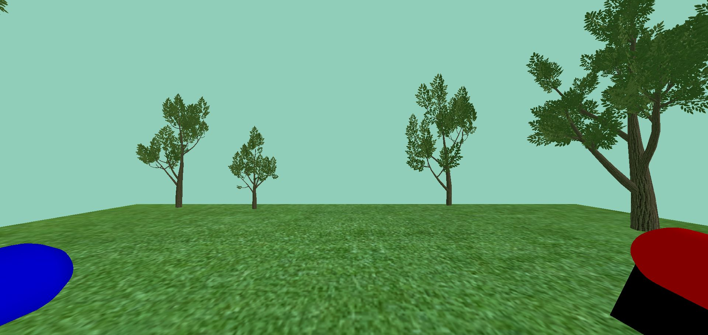

# Interactive Media Prototypes

Two small interactive prototypes collected in one repository: a Unity 2D platformer experiment and a Godot WebXR navigation experiment.

[Play the live WebXR demo](https://haribo841.github.io/rwr/) | [Source code](https://github.com/haribo841/rwr) | [Unity project](Unity/) | [WebXR project](webxr-demo/) | [Report an issue](https://github.com/haribo841/rwr/issues)

## Choose a prototype

| Prototype | What it demonstrates | Starting point |
| --- | --- | --- |
| Unity 2D platformer | Horizontal movement, jumping, animation states, sprite direction, and a camera that follows the player. | [`Unity/Assets/Scenes/SampleScene.unity`](Unity/Assets/Scenes/SampleScene.unity) |
| Godot WebXR experiment | WebXR session detection, thumbstick locomotion, raycast teleportation, and controller input handling. | [Play online](https://haribo841.github.io/rwr/) or inspect [`webxr-demo/project.godot`](webxr-demo/project.godot) |

## Live preview

[](https://haribo841.github.io/rwr/)

*The Godot WebXR scene deployed at [haribo841.github.io/rwr](https://haribo841.github.io/rwr/).*

## Quick start

The fastest way to try the repository is the [live WebXR demo](https://haribo841.github.io/rwr/). There is no packaged desktop or mobile release.

### Play online

Open [haribo841.github.io/rwr](https://haribo841.github.io/rwr/) in a modern browser. You can explore the scene in the browser; a WebXR-compatible browser and headset are required to enter immersive VR.

### Unity platformer

1. Install Unity Hub with Unity `2021.3.31f1`.
2. Open the `Unity` folder as a project.
3. Open `Assets/Scenes/SampleScene.unity` and select **Play**.

### WebXR source project

1. Install Godot `4.5` and import `webxr-demo/project.godot` to inspect or modify the source project.
2. To serve the included browser export locally, run:

   ```powershell
   python -m http.server 8080 --directory docs
   ```

3. Open `http://localhost:8080` in a browser. A WebXR-compatible browser and headset are required to start immersive VR.

## Supported environment

| Environment | Support |
| --- | --- |
| Unity Editor 2021.3.31f1 | Source project for the 2D platformer. |
| Godot 4.5 | Source project for the WebXR experiment. |
| Modern browser with WebXR support | Required for immersive VR in the browser export. |
| Packaged desktop or mobile release | Not published. |

## Key features

- Player movement, jumping, animation states, sprite flipping, and camera follow in Unity.
- WebXR support detection and immersive-VR session initialization in Godot.
- Thumbstick movement relative to the viewer's camera orientation.
- Raycast teleportation that preserves the camera offset from the XR origin.

## Documentation

The [Unity source](Unity/) and [Godot WebXR source](webxr-demo/) are the implementation references. The prebuilt browser files are stored in [`docs/`](docs/).

## License and issues

No license file is currently published. For questions or reproducible defects, use [GitHub Issues](https://github.com/haribo841/rwr/issues).

The original short description is preserved in [the README archive](docs/archive/README-2026-09-06.md).
